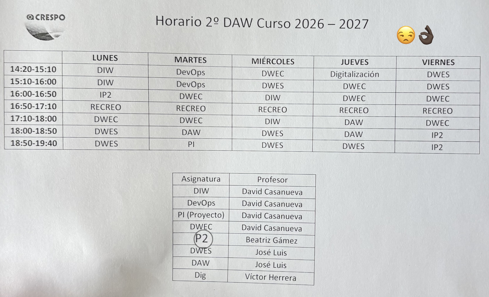

# Repositorio-Test
Repositorio Test, creado en clase

**Flujo para el día a día**

Cada vez que cambies, añadas o borres archivos en la carpeta:

cd '/Users/pablo/Documents/Git Documentos'
git add .
git commit -m "Descripción breve del cambio"
git push

**Horario**     
